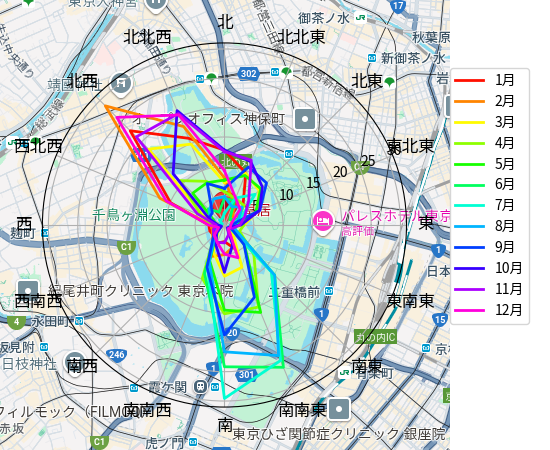

# wind rose

[風配図](https://ja.wikipedia.org/wiki/%E9%A2%A8%E9%85%8D%E5%9B%B3)（Wind Rose Diagram）を作る

## データの準備

* 地図データ
    * Google Maps API を使うのが面倒だったので、自分で用意してください
    * 自分な好きな地図のスクリーンショットを撮って `map.png` として保存
        * 画像サイズは 640 pixel x 640 pixel を想定
        * 北が上になっている画像であること
        * 画像は回転させるので、中心に注意
* 気象データ
    * 気象庁のページをスクレイピングするのが面倒だったので、自分で用意してください
    * 気象庁の[過去の気象データ・ダウンロード](https://www.data.jma.go.jp/risk/obsdl/)に行く
    * 地点を選ぶ
        * 自分の好きな地点を選ぶ
    * 項目を選ぶ
        * データの種類
            * 時別値
        * 項目
            * 風向・風速
    * 期間を選ぶ
        * 「連続した期間で表示する」「最近一年」
    * 「CSVファイルをダウンロード」ボタンを押してダウンロード
    * ダウンロードした CSV ファイルの前処理
        * 文字コードを UTF-8 に変換
        * CSV のヘッダを削除
    * ファイル名を `wind.csv` に変換して保存

## 環境構築

* [uv](https://docs.astral.sh/uv/) をインストール
* [Noto Sans Japanese](https://fonts.google.com/noto/specimen/Noto+Sans+JP) をインストール
* `make setup-environment`

## 動かし方

* `./wind_rose.py [--angle ANGLE]`
    * `ANGLE` の単位は度（°）で、半時計回り方向
    * 省略した場合は `0`（北が上）

## 出力

* `diagrams` ディレクトリ以下に PNG 画像が出力される
* ファイル名は `<種別>_<期間>.png`
    * 種別
        * `wind_percentage`： 風向の割合（一般的な風配図）（単位: %）
        * `wind_mean`： 平均風速（単位: m/s）
        * `wind_max`： 最大風速（単位: m/s）
    * 期間
        * `year`： 通年
        * `summer`： 冬以外の季節（4月〜11月）
        * `winter`： 冬（12月〜3月）

## サンプル

